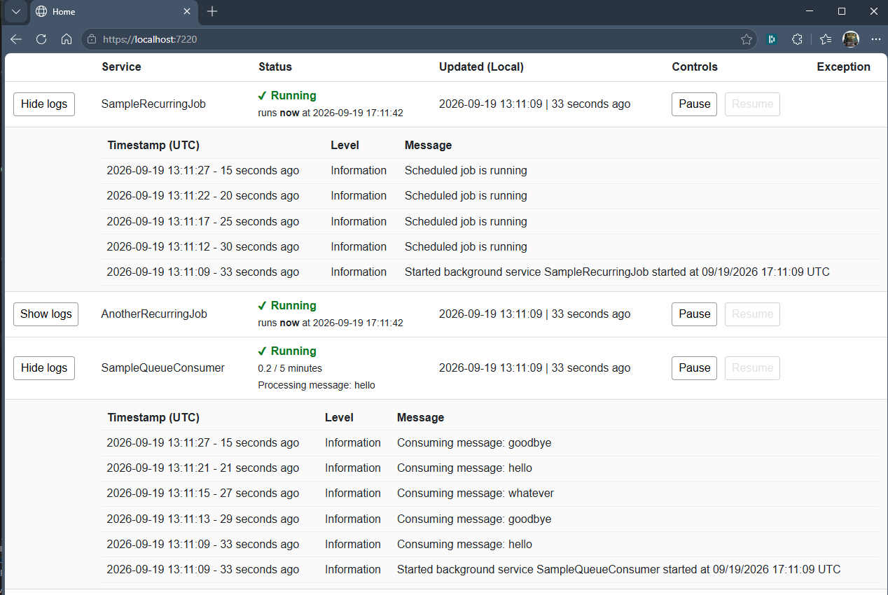

There are a wealth background job frameworks and libraries out there -- Hangfire, Quartz, and Coravel come to mind. ASP.NET Core has its own [BackgroundService](https://learn.microsoft.com/en-us/aspnet/core/fundamentals/host/hosted-services?view=aspnetcore-10.0&tabs=visual-studio#backgroundservice-base-class). As a matter of preference, I happen to like Coravel. But more than that, I like the flexibility that the native BackgroundService offers. The problem with BackgroundService is its very flexibility. It's a bare-minimum service shell that I have found too easy to mis-use. This project, therefore, is a thin wrapper around the native BackgroundService, adding a few features to give you more of a "pit of success."

First off, what makes BackgroundService hard to use? When you create an empty BackgroundService and create its default implementation, you start with some boilerplate:

```csharp
internal class SampleBackgroundService : BackgroundService
{
    protected override Task ExecuteAsync(CancellationToken stoppingToken)
    {
        throw new NotImplementedException();
    }
}
```

The problem with this is it's not clear what pattern to implement to give you a service that can be stopped and started at will, or for that matter scheduled -- that can handle errors and be recoverable at runtime. There's a core `while` loop you need along with some carefully positioned `try/catch` blocks along with a little bit of state management. It's not obvious at all from the default boilerplate what this should look like.

That's where [ManagedBackgroundService](Abstractions/ManagedBackgroundService.cs) comes in. It's an abstract class just like the native BackgroundService. The work your service does goes in the `ExecuteInternalAsync` method. There are `Pause` and `Resume` methods that do what they sound like, along with a `Status` property that returns Running, Paused, or Crashed. If your `ExecuteInternalAsync` throws an exception, the service goes into a Paused state. A paused job can be resumed. If an exception occurs outside the inner `try` block, the job goes into a Crashed state. If that happens, it can't be resumed, and you must restart the host app.

# Startup Configuration
Add your BackgroundService instances to your app at startup using [ServiceExtensions](Abstractions/Infrastructure/ServiceExtensions.cs) like this:

```csharp
services.AddManagedBackgroundService<your type>();
```

Add the optional [health check](Abstractions/Infrastructure/BackgroundServicesHealthCheck.cs):

```csharp
services.AddHealthChecks().AddCheck<BackgroundServicesHealthCheck>("Background Services");
```
Note that health checks are a [bigger topic](https://learn.microsoft.com/en-us/aspnet/core/host-and-deploy/health-checks?view=aspnetcore-10.0) -- there are different ways to fine tune and serve health checks that are outside the scope of this project.

# Derived Classes

`ManagedBackgroundService` powers these two derived classes:

- [QueueConsumerBackgroundService](Abstractions/QueueConsumerBackgroundService.cs). You must implement a `PersistentQueue` abstraction that handles your underlying storage mechanism (relational database, cloud queues, etc.). The queue consumer uses a message handler registry pattern where you map message type names to handler delegates. Key features include:
    - Batch dequeuing with configurable batch size
    - Automatic deserialization of messages based on stored type information
    - Error handling via the `OnMessageFailedAsync` hook for custom retry or dead-letter logic
    - Performance tracking via `IQueueConsumerPerformance` (consume rate per configurable time window)
    - Configurable delays: `EmptyQueueDelay` (how long to wait when queue is empty) and `ProcessingDelay` (delay between batches)
    - Database-agnostic design: implement queue dequeue logic using platform-specific best practices (e.g., SQL Server's `DELETE ... OUTPUT`, Postgres's `FOR UPDATE SKIP LOCKED`, etc.)
- [ScheduledBackgroundService](Abstractions/ScheduledBackgroundService.cs) is for running scheduled jobs. You must implement the `ExecuteScheduledAsync` and `GetNextRunTime` methods. You can use something like [Cronos](https://github.com/HangfireIO/Cronos) with standard cron expressions to do this. One reason I made this class though is I find cron expressions hard to use, so I introduced my own feature [RecurrencePattern](Abstractions/Infrastructure/RecurrencePattern.cs) which is my alternative to cron. See [tests](Testing/RecurrencePatternTests.cs) to see how to use this. In essence, you write expressions like this:
    - `d[mon..fri] t[9:30am, 3:30pm] tz:America/New_York` = Monday through Friday at 9:30am and 3:30pm, eastern time
    - `*90min b[7:30, 15:30]` = every 90 minutes between 7:30am and 3:30pm UTC

# Logging Features
`ManagedBackgroundService` requires an `ILoggerFactory`. Do not inject your own `ILogger<T>` type. This way, your derived classes will automatically get logs categorized for the derived type name rather than the base class.

An in-memory logger [InMemoryLogger](Abstractions/Logging/InMemoryLogger.cs) is added when you add background jobs to your service collection. This gives you access to your jobs' recent activity without relying on a particular observability solution. Any other logging providers you've configured will still work. The [Dashboard](RCL/Dashboard.razor) Blazor component presents running job info with related logs using the [IInMemoryLogQuery](Abstractions/Logging/IInMemoryLogQuery.cs) interface, which offers a few common log queries.

# Razor Class Library
The [RCL](/RCL/RCL.csproj) project has components for Blazor Server apps for managing jobs, in particular:
- [Dashboard](RCL/Dashboard.razor) used here in the [demo page](WebDemo/Components/Pages/Home.razor)




